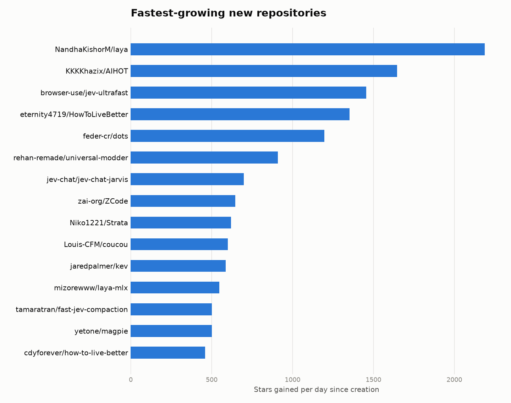
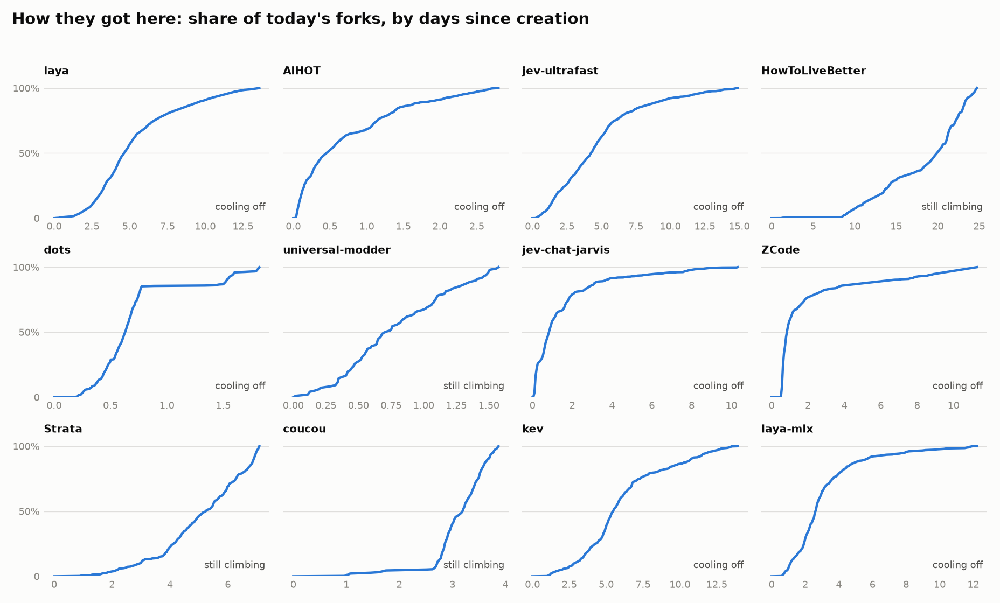
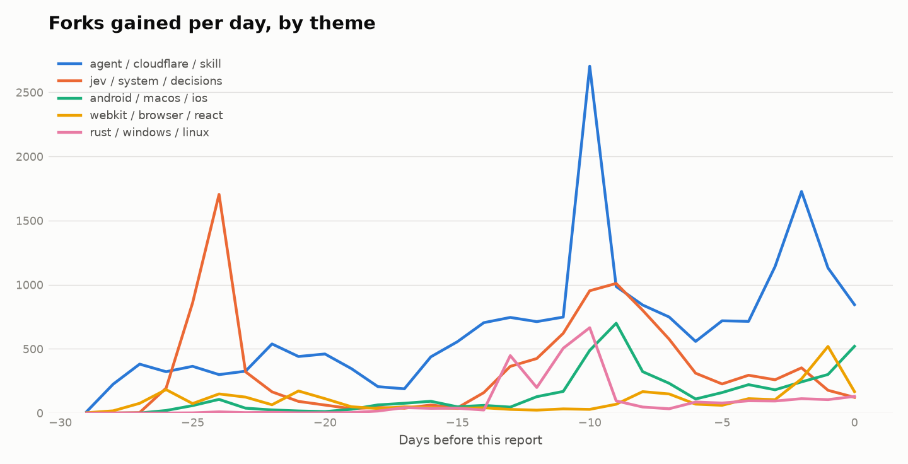

# GitHub trend radar — 2026-10-01

100 repositories created in the last 30 days, ranked by stars per day.

## Fastest growing

| Repository | Language | Stars | Stars/day | Forks | Now vs peak | Shape | Forks in 7d | About |
|---|---|--:|--:|--:|--:|---|--:|---|
| [NandhaKishorM/laya](https://github.com/NandhaKishorM/laya) | Python | 29,724 | 2,188 | 2,577 | 14% | cooling off | 2,781 | Non-autoregressive System 1 decision engine. Typed choice, score and… |
| [KKKKhazix/AIHOT](https://github.com/KKKKhazix/AIHOT) | TypeScript | 4,601 | 1,645 | 1,283 | 16% | cooling off | 1,419 | 一个自己找热点、自己写日报的网站框架。把信源和精选标准换成你的，它就是你的行业热点站。 |
| [browser-use/jev-ultrafast](https://github.com/browser-use/jev-ultrafast) | Python | 21,677 | 1,456 | 1,529 | 12% | cooling off | 1,611 | Fastest and cheapest web agent |
| [eternity4719/HowToLiveBetter](https://github.com/eternity4719/HowToLiveBetter) | HTML | 33,391 | 1,352 | 2,567 | 100% | still climbing | 4,297 | 高性价比人生指南: 长寿防病、急救、省钱理财、法律红线、失业与工伤、医保社保、恋爱婚育、怀孕育儿、创业与做平台合规、出国与技能。每条写明成… |
| [feder-cr/dots](https://github.com/feder-cr/dots) | Python | 2,179 | 1,197 | 374 | 17% | cooling off | 400 | Open-source dots for the web: an AI agent with its own browser, one t… |
| [rehan-remade/universal-modder](https://github.com/rehan-remade/universal-modder) | Python | 1,431 | 909 | 97 | 80% | still climbing | 181 | Point Claude at any game. Skills, tools and the fal MCP that let Clau… |
| [jev-chat/jev-chat-jarvis](https://github.com/jev-chat/jev-chat-jarvis) | Kotlin | 7,217 | 700 | 1,215 | 4% | cooling off | 1,249 | 装在手机上的对话副驾：在 QQ / X / 飞书里读懂对方、给出候选回复、一键填入输入框，发不发由你。非侵入，只读屏幕，不 hook 不改… |
| [zai-org/ZCode](https://github.com/zai-org/ZCode) | TypeScript | 7,286 | 646 | 2,216 | 8% | cooling off | 2,429 | Z.ai's coding agent harness. Powerful, intelligent, extensible. |
| [Niko1221/Strata](https://github.com/Niko1221/Strata) | C++ | 4,393 | 620 | 388 | 100% | still climbing | 1,132 | Qwen3.8-Flash-Next on any consumer hardware: one-click install for Wi… |
| [Louis-CFM/coucou](https://github.com/Louis-CFM/coucou) | Swift | 2,326 | 601 | 335 | 87% | still climbing | 707 | A tiny friend that lives in your notch (macOS) or at the top of your… |
| [jaredpalmer/kev](https://github.com/jaredpalmer/kev) | Python | 8,173 | 587 | 519 | 21% | cooling off | 579 | Jev-like family of decision models built on top of Qwen3.5/3.8 you ca… |
| [mizorewww/laya-mlx](https://github.com/mizorewww/laya-mlx) | Python | 6,686 | 548 | 533 | 4% | cooling off | 544 | Native MLX runtime for Laya typed decision models — 7–14 ms short dec… |
| [tamaratran/fast-jev-compaction](https://github.com/tamaratran/fast-jev-compaction) | TypeScript | 7,298 | 502 | 476 | 15% | cooling off | 524 | Claude Code plugin that replaces the compaction summary with Jev deci… |
| [yetone/magpie](https://github.com/yetone/magpie) | Go | 4,059 | 501 | 258 | 80% | still climbing | 390 | Every agent's model. One place. Codex on DeepSeek, Claude Code on Kim… |
| [cdyforever/how-to-live-better](https://github.com/cdyforever/how-to-live-better) | HTML | 6,047 | 459 | 417 | 65% | steady | 588 | 《高性价比人生指南》全书 528 条的在线单页阅读版：手机可读、可搜索、零依赖、支持离线 |

GitHub only shows a repository's stargazer list to its owner, so growth over time is measured from forks, whose timestamps are public. *Now vs peak* compares forks per day in the most recent window with the repo's best window ever. A dash means the repo has too few forks to draw a curve.

## Growth curves

## How good is the forecast?

Each curve's last 30% was hidden, predicted from the first 70%, and compared with what really happened. Median error in total forks:

| Model | Median error |
|---|--:|
| Flat (no more forks) | 11.8% |
| Linear (recent rate continues) | 10.4% |
| Decay (recent rate keeps fading) | 5.1% |

## Themes

- **agent / cloudflare / skill** — 52 repos, 163,699 stars. Leaders: [eternity4719/HowToLiveBetter](https://github.com/eternity4719/HowToLiveBetter), [browser-use/jev-ultrafast](https://github.com/browser-use/jev-ultrafast), [zai-org/ZCode](https://github.com/zai-org/ZCode)
- **jev / system / decisions** — 18 repos, 84,951 stars. Leaders: [NandhaKishorM/laya](https://github.com/NandhaKishorM/laya), [jaredpalmer/kev](https://github.com/jaredpalmer/kev), [tamaratran/fast-jev-compaction](https://github.com/tamaratran/fast-jev-compaction)
- **android / macos / ios** — 14 repos, 37,190 stars. Leaders: [jev-chat/jev-chat-jarvis](https://github.com/jev-chat/jev-chat-jarvis), [Mak5er/AirCard](https://github.com/Mak5er/AirCard), [yetone/magpie](https://github.com/yetone/magpie)
- **webkit / browser / react** — 8 repos, 23,414 stars. Leaders: [lnkiai/m3e-canvas](https://github.com/lnkiai/m3e-canvas), [CopilotKit/openmuse](https://github.com/CopilotKit/openmuse), [driceroland/Search](https://github.com/driceroland/Search)
- **rust / windows / linux** — 8 repos, 17,297 stars. Leaders: [Niko1221/Strata](https://github.com/Niko1221/Strata), [mcncarl/jianying-headless](https://github.com/mcncarl/jianying-headless), [qingjian-team/qingjian](https://github.com/qingjian-team/qingjian)

## Languages

| Language | Repos |
|---|--:|
| Python | 36 |
| TypeScript | 17 |
| JavaScript | 8 |
| HTML | 7 |
| Swift | 7 |
| Unknown | 6 |
| Kotlin | 5 |
| Go | 5 |
| Rust | 5 |
| Lean | 2 |
